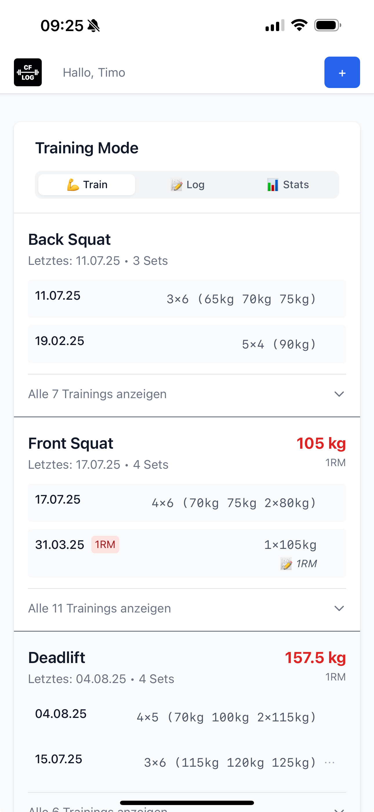
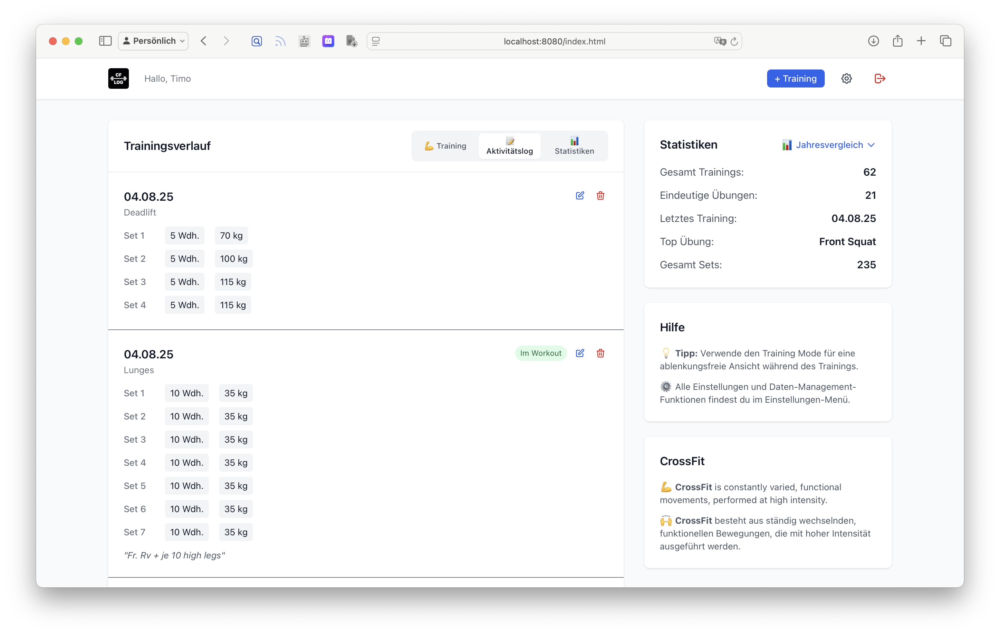
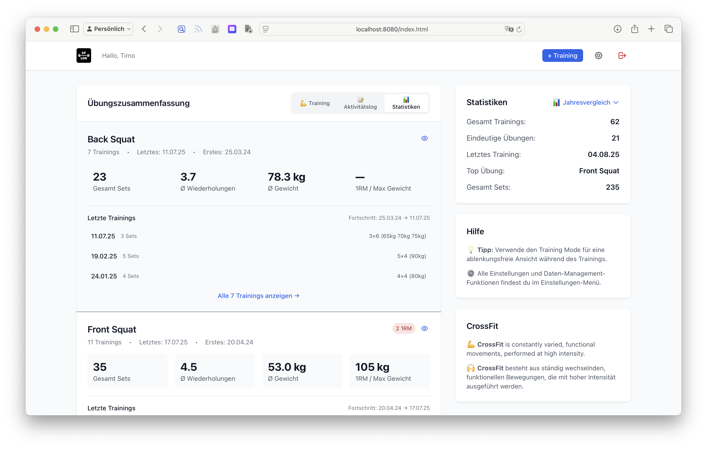

# 🏋️‍♂️ cf-log - Flexibles Trainingslog

Ein modernes, flexibles Trainingslog mit GitHub Gists oder WebDAV als Datenspeicher. Kein Backend, keine Anmeldung nötig - deine Daten gehören dir!

## ✨ Features

- **🔐 Sichere Datenspeicherung** über GitHub Gists oder WebDAV
- **📱 Responsive Design** für Desktop und Mobile
- **🎨 Moderne UI** mit Tailwind CSS
- **📊 Statistiken** und Übersichten
- **📥📤 Import/Export** von JSON-Daten
- **⚙️ Anpassbare Einstellungen**
- **🔄 Offline-First** Ansatz
- **📱 PWA-Unterstützung**


## 🖼️ Screenshots

<div align="center">

### 📱 Mobile Trainings View
<br>
*Optimiert für das Training - übersichtlich und ablenkungsfrei*

### 📝 Aktivitäts Log

*Chronologische Übersicht aller Trainings mit Details*

### 📊 Statistik View

*Detaillierte Statistiken und Jahresvergleiche*

</div>


## 🚀 Schnellstart

### Option 1: GitHub Gists

#### 1. GitHub Token erstellen

1. Gehe zu [GitHub Settings > Tokens](https://github.com/settings/tokens)
2. Klicke auf "Generate new token (classic)"
3. Vergib einen Namen und Ablaufdatum
4. Setze **nur** das Häkchen bei `gist`
5. Klicke "Generate token" und kopiere den Token

#### 2. Anwendung starten

1. Öffne `index.html` in deinem Browser
2. Wähle "GitHub Gists" als Speichermethode
3. Gib deinen Namen und GitHub Token ein
4. Klicke "Neues Profil anlegen"
5. Fertig! 🎉

### Option 2: WebDAV

#### 1. WebDAV Server einrichten

Unterstützte WebDAV Server:
- **Nextcloud / ownCloud** (kostenlos, selbst gehostet)
- **Synology NAS** (WebDAV aktivieren)
- **QNAP NAS** (WebDAV aktivieren)
- **Dropbox** (mit WebDAV-Erweiterung)
- **Google Drive** (mit WebDAV-Erweiterung)

#### 2. Anwendung starten

1. Öffne `index.html` in deinem Browser
2. Wähle "WebDAV" als Speichermethode
3. Gib WebDAV URL, Benutzername und Passwort ein
4. Optional: Gib einen benutzerdefinierten Dateinamen ein
5. Klicke "Verbinden"
6. Fertig! 🎉


## 📁 Datenstruktur

Die Anwendung speichert deine Daten in einer flexiblen JSON-Struktur:

```json
{
  "user": {
    "name": "Max Mustermann",
    "created": "2024-01-01"
  },
  "exercises": [
    {
      "id": "unique-id",
      "date": "2024-01-15",
      "exercise": "Bankdrücken",
      "sets": [
        {
          "reps": 8,
          "weight": 60,
          "notes": "Fühlte sich gut an"
        }
      ],
      "inWorkout": true,
      "is1RM": false,
      "notes": "Gutes Training heute"
    }
  ],
  "settings": {
    "defaultExercises": ["Bankdrücken", "Kniebeugen", "Klimmzüge"],
    "theme": "light"
  }
}
```


## 🛠️ Technologie-Stack

- **Frontend**: Vanilla JavaScript, HTML5, Tailwind CSS
- **Datenspeicherung**: GitHub Gists API oder WebDAV
- **PWA**: Web App Manifest
- **Keine Abhängigkeiten**: Nur CDN für Tailwind CSS


## 📱 Verwendung

### Training hinzufügen

1. Klicke auf "Training" im Header
2. Wähle Datum und Übung
3. Füge Sets hinzu (Wiederholungen + Gewicht)
4. Optional: Notizen und Flags setzen
5. Speichern

### Daten verwalten

- **Bearbeiten**: Klicke auf das Bearbeiten-Symbol bei einem Training
- **Löschen**: Klicke auf das Löschen-Symbol (mit Bestätigung)
- **Exportieren**: Klicke "Daten exportieren" in den Schnellaktionen
- **Importieren**: Klicke "Daten importieren" und wähle eine JSON-Datei

### Einstellungen

- **Standard-Übungen**: Bearbeite die Liste der vordefinierten Übungen
- **Profil**: Ändere deinen Namen oder erstelle ein neues Profil

## 🚀 Demo & Testen

Du kannst die Anwendung direkt hier testen:  
[https://zzeeiikk.github.io/cf-log](https://zzeeiikk.github.io/cf-log)

### Projektstruktur

```
cf-log/
├── index.html          # Haupt-HTML-Datei
├── main.js            # JavaScript-Anwendung
├── manifest.json      # PWA-Manifest
└── README.md          # Diese Datei
```

### Datenimport

Die Anwendung unterstützt das Importieren von Daten aus der alten Backend-Version:

```json
[
  {
    "datum": "2024-06-10",
    "uebung": "Bankdrücken",
    "sets": [{"wiederholungen": 8, "gewicht": 60}],
    "im_workout": true
  }
]
```

## 🛡️ Datenschutz & Sicherheit

- **Keine Server-Logs**: Alle Daten werden direkt in GitHub Gists oder auf deinem WebDAV Server gespeichert
- **Private Speicherung**: Deine Daten sind standardmäßig privat
- **Lokale Verarbeitung**: Alle Berechnungen finden im Browser statt
- **Keine Tracking-Cookies**: Die Anwendung verwendet keine Cookies
- **Vollständige Kontrolle**: Bei WebDAV hast du die vollständige Kontrolle über deine Daten

## 🤝 Beitragen

Verbesserungen und Bug-Reports sind willkommen! 

### Bekannte Einschränkungen

- **GitHub Gists**: 
  - API Rate Limits (5000 Requests/Stunde für authentifizierte Benutzer)
  - Maximale Gist-Größe: 100MB
- **WebDAV**:
  - Abhängig von der Server-Konfiguration
  - CORS-Einschränkungen können auftreten
  - Server muss WebDAV-Protokoll unterstützen

## 📄 Lizenz

Creative Commons Attribution-NonCommercial-ShareAlike 4.0 International License - siehe LICENSE-Datei für Details.

Diese Lizenz erlaubt:
- **Teilen** - Kopieren und Weiterverbreiten in jedem Medium oder Format
- **Anpassen** - Remixen, Transformieren und Aufbauen auf dem Material

Unter folgenden Bedingungen:
- **Namensnennung** - Du musst angemessene Urheberschaft angeben
- **Nicht-kommerziell** - Du darfst das Material nicht für kommerzielle Zwecke verwenden
- **Weitergabe unter gleichen Bedingungen** - Wenn du das Material remixst, transformierst oder darauf aufbaust, musst du deine Beiträge unter derselben Lizenz wie das Original verbreiten

## 🙏 Danksagungen

- [Tailwind CSS](https://tailwindcss.com/) für das CSS-Framework
- [GitHub Gists API](https://docs.github.com/en/rest/gists) für die Datenspeicherung
- Alle Benutzer für Feedback und Verbesserungsvorschläge

---

**Viel Spaß beim Training! 💪** 
